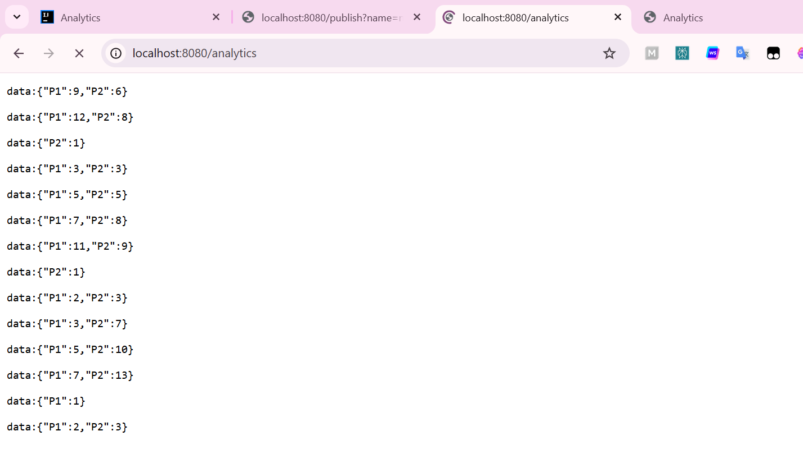

# Kafka Spring Cloud Stream — Demo

Supplier ➜ **T3** ➜ KStream (fenêtre 5s, **count-store**) ➜ **T4** ➜ **/analytics** (SSE) ➜ page **/** (courbes).

## Démarrer
```bash
# 1) Lancer Kafka
docker compose up -d

# 2) Build & run l’application (par défaut sur :8080)
./mvnw -U clean verify
./mvnw spring-boot:run
```

## Tester
- **Publier un event** :  
  `http://localhost:8080/publish?name=nouhayla&topic=T2`
- **Flux SSE brut** :  
  `http://localhost:8080/analytics`
- **Courbes (Chart.js)** :  
  `http://localhost:8080/`

> Topics : **T3** (in), **T4** (out) • State store : **count-store** • Filtre : `duration > 100`.

---

## Screenshots

### 1) Démarrage des conteneurs Kafka
**Fichier :** `resultat/DockerUp.png`  


### 2) Publication d’un évènement
**Fichier :** `resultat/publish.png`  


### 3) Flux SSE `/analytics`
**Fichier :** `resultat/analyticsData.png`  


### 4) Courbes temps réel (page `/`)
**Fichier :** `resultat/analyticsGraph.png`  


---


